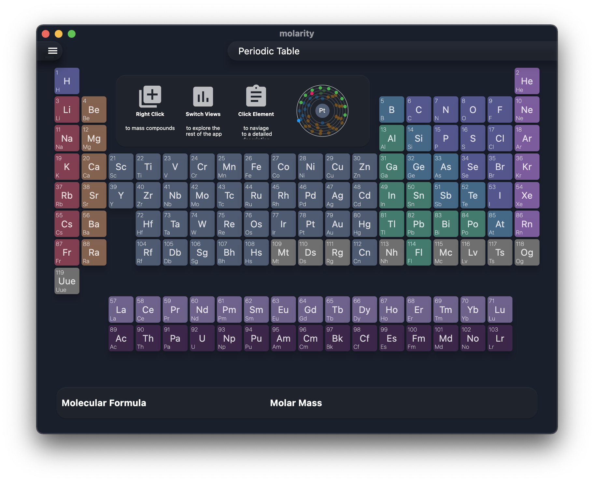

# Molarity

Molarity is an interactive desktop (thus far) periodic table and chemoinfomatics app, with a focus on performance, functionality and intuitive design.

Currently the project is in a usable state with:

- A simple molecular mass calculator.
- A periodic trends overlay for the periodic table.
- A detailed atomic data screen.



## Project State

### Performance

Current performance metrics include:

#### MacOS 11, Big Sur, 2.6 GHz 6-Core Intel Core i7

|Metric| Value |
|------|-------|
|Memory| 86.8 MB, during idle |
|CPU | 0%, during idle \| 35%, during animation load |
|Disk Space | ~43.6 MB on disk |
| Analysis | Based on this data, Molarity should be have a negligible effect on batter life. It is 5x smaller than the electron version. |

### Functionality

The project is usable, containing:

- A simple molecular mass calculator.
- A periodic trends overlay for the periodic table.
- A detailed atomic data screen.

#### Goals

- A local interface for a small subset of Pubchem. This would effectively involve scraping pubchem for a portion of information, then preparing a store for this data with a database like [Isar](https://pub.dev/packages/isar). This means the data could be aggregated and searched efficiently for connections between elements. This would also allow a separate compound search interface. **Alternatively,** this could be a simple web portal for pubchem, however, this is undesirable due to the sheer all consuming mass that is pubchem. Realistically a feature like this would constitute a combination of these two approaches.
- A molecular mass history page that is positioned below the periodic table, and allows people to remove accidental or unwanted compounds, but quickly reference frequently used ones. This could initially be implemented using [Shared Preferences](https://pub.dev/packages/shared_preferences), but in the future it would be best to combine integrate it with Isar.
- Remembrance of molecular properties quick show. See above for the use of persistent storage.

### Intuitive Design

Molarity uses a rounded border card based design for most content elements. Which has been set globally to `BorderRadius.circular(15.0)`. This project has a moderate level of colour based design, although this could stand to be improved (Perhaps a meta comment on this paragraph.).

## Building

This project is a standard flutter project, and a simple `flutter pub get` should get you up and running. It should be noted that this project was built using `2.6.0-0.0.pre`, however, it should work with the current stable branch of flutter.

### Release

#### Macos

This requires the necessary MacOS development tooling, and access to a MacOS machine. The build instructions are as follows:

Run

```shell
flutter build macos --release
```

This executable will be found at: `./build/macos/Build/Products/Release/molarity.app`

This can be used on its own, or an icon can be attached. Since flutter has no tooling for doing this, using `⌘+i` on the `.app`, then dragging the desired icon onto the flutter icon in the panel. No icon is provided. For whatever reason, the icons in `assets/distribution` will not work on mac.

#### Windows

Building on windows currently uses the flutter [Msix](https://pub.dev/packages/msix) package. Hence the project will be built into an Msix installer. This is required to be run on a Windows machine.

Run 

```shell
flutter build windows
flutter pub run msix:create
```

This will create an msix. Currently this is signed using `test_certificate.pfx`, this can be found in the Msix repoistory at [lib/assets/test_certificate.pfx](https://github.com/YehudaKremer/msix/blob/main/lib/assets/test_certificate.pfx). This must be installed onto the target machine's trusted root certificate authority. This has a password of **password: 1234**